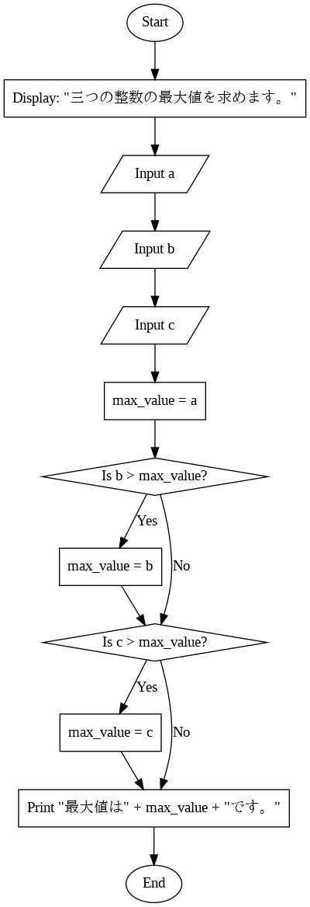
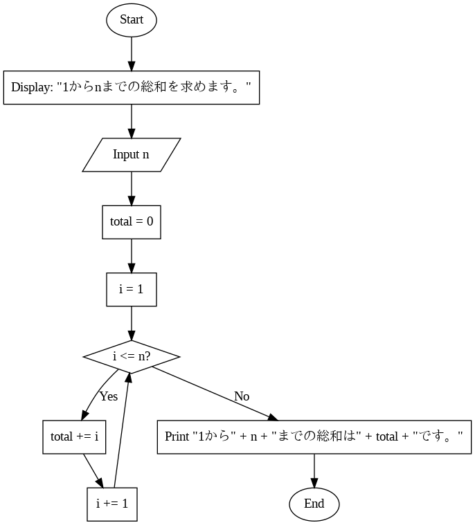

# 第1回 基本的なアルゴリズム

1. データ構造とアルゴリズムを学ぶ理由
1. 参考書のサンプルコードの実行方法

## 作業

次の作業をやってみよう．（AI にやらせてもいいけど）

1. [参考書のサポートサイト](https://www.bohyoh.com/Books/NewMeikaiPythonAlgorithm_2nd/index.html)からコードをダウンロードする．
1. chap01/max3.py を表示する．
1. chap01/max3.py を実行する．

## フローチャート

Google Colab 上で Gemini に聞けば，次のようなフローチャートを作れるだろう．



ここに現れないがよく使うものに，ループ端と端子がある．

## 総和を求める二つの方法

1. アルゴリズムを自分で実装する．
1. 言語の機能やライブラリを使う．

### アルゴリズムを自分で実装する．

次のフローチャートのプログラムを書いてみよう．



### 言語の機能やライブラリを使う．

やりたいことがわかったら，もっと簡単に書けないか，考えてみよう．

よく使われるアルゴリズムは言語自体やライブラリで用意されている．バグが少ないし性能も高いから，実用上はそれを使うべきである．しかし，そういうものに頼らずに自分で書いてみるのも面白いし，勉強になる．

## プレゼン課題

グループで担当者を決める（1題/人，重複無し）．

### 1

整数が入力されることを仮定して，chap01/max3.py が正しく動作することを証明してください．

### 2

次の二つの実行例を再現するような Python のコードを書いて，それについて説明してください．（正確な仕様は自分で決めてかまいませんが，説明を聞く人が納得しやすいものにしてください．）

```
aからbまでの総和を求めます。
整数a：3
整数b：7
3から7までの総和は25です。
```

```
aからbまでの総和を求めます。
整数a：7
整数b：3
3から7までの総和は25です。
```

### 3

Python の `break` と `continue` について，具体例を使って説明してください．

### 4

次の実行例を再現するような Python のコードを書いて，それについて説明してください．（正確な仕様は自分で決めてかまいませんが，説明を聞く人が納得しやすいものにしてください．）

```
左下直角の二等辺三角形
短辺の長さ：6
*
**
***
****
*****
******
```

